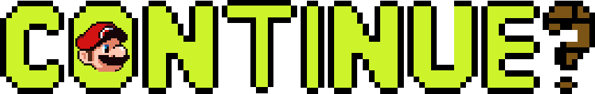
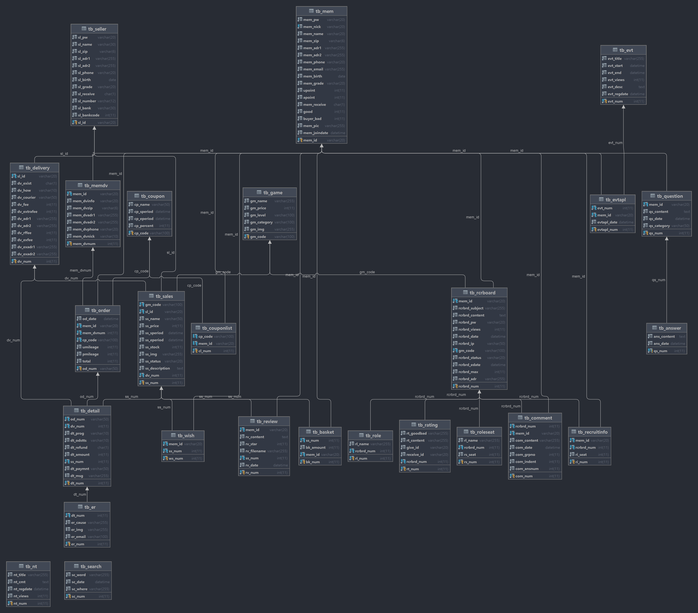
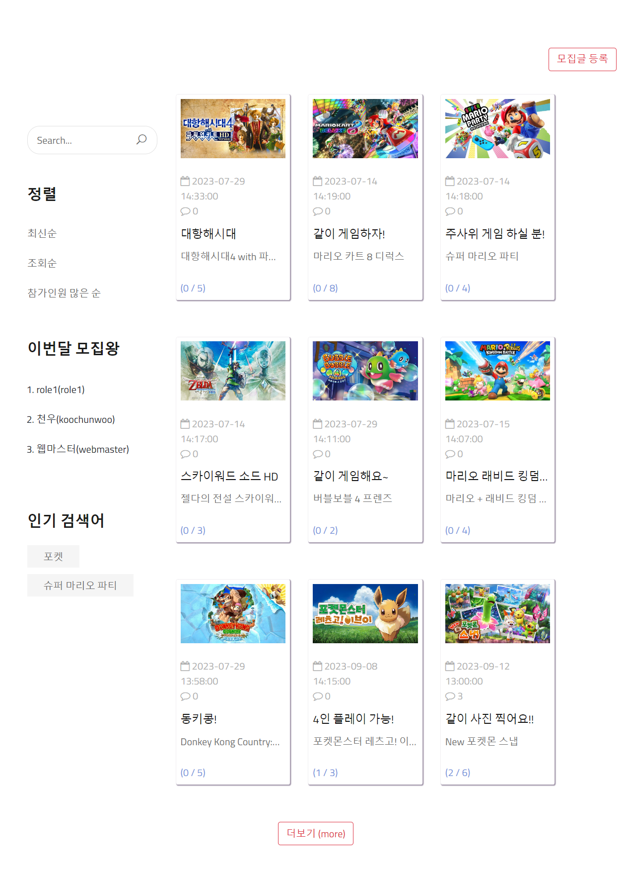
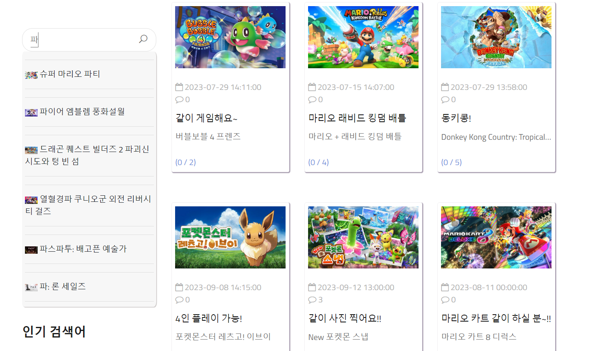
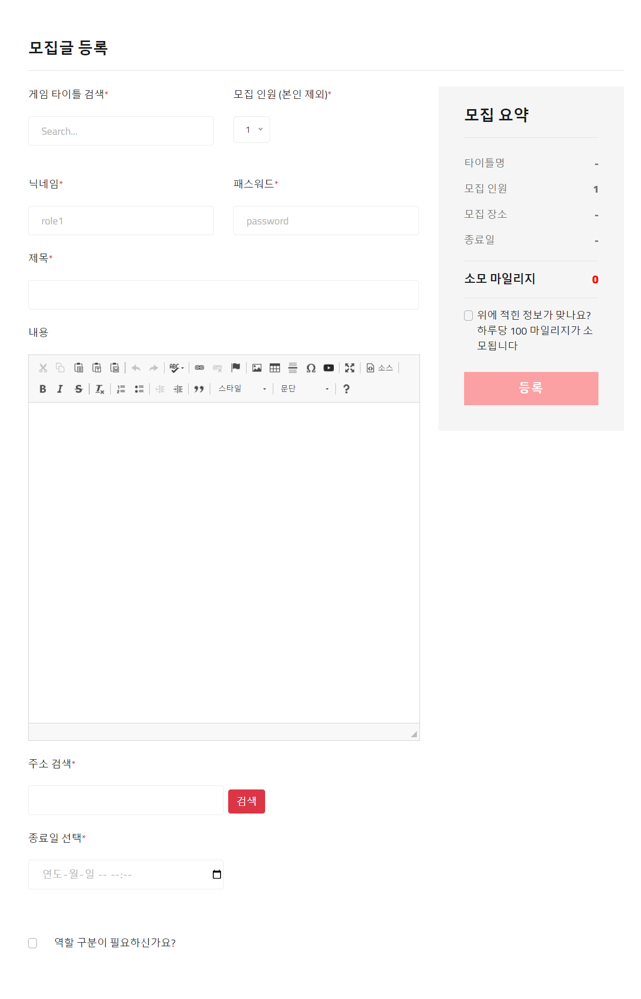
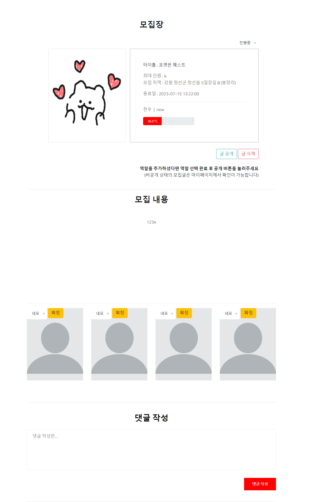

# Continue?

  

 

- **한 줄 소개**

콘솔 게임 오픈 마켓 및 모집 게시판

 

- **제작 기간**

2022.11.16 ~ 2022.12.26

- **팀 구성**

4명

 

- **사용 Skill**

Frontend : HTML, CSS, Javascript, jQuery, JSTL, Bootstrap

Backend : Java, JSP, SpringBoot

Database : MyBatis, MariaDB

Server : Apache Tomcat

 

- **Github**

: [https://github.com/daaaaaeun/ProjectContinue](https://github.com/daaaaaeun/ProjectContinue)

 

- **호스팅**

: [http://ed040820.cafe24.com](http://ed040820.cafe24.com)

 
 

<aside>

✅ **회원 & 판매자 로그인** 
ID : webmaster 
PW : 12345 
 
**관리자 로그인** (최상단 좌측의 continue?를 클릭하여 관리자 모드 진입 가능) 
ID : admin 
PW : admin 

</aside>

 

- **ERD**
    

    

 

- **담당 업무**
1. 모집 부분 : 모집글 등록, 모집 메인, 모집 상세
2. 관리자 부분 : 자동 등록
3. 미니게임

 

- **기능 설명 및 시연 이미지**
    

    

---

- **검색 기능**

: 관리자 페이지에서 크롤링 해온 데이터를 베이스로 검색창에 검색시 자동 완성을 위해 게임 목록이 뜹니다. 2글자 이상 작성 후 Enter 혹은 돋보기 버튼 클릭함으로서 검색이 가능합니다.

ㄴ “포켓” 검색어로 검색한 결과

사용자가 입력한 제목이 아닌 게임명을 기준으로 검색합니다.

검색시 인기 검색어에 해당 검색어가 저장됩니다.

---

- **정렬**, **이번달 모집왕**

: 최신순, 조회순, 참가인원 많은 순으로 정렬 기능

: 이번달에 글을 쓴 모집글 작성자 중 상위 5명만을 표시 (사진상으로는 3개의 아이디만 이번달에 작성했기에 3위까지만 출력된 상태입니다) 

---

- **인기 검색어**

: 검색자에 상관 없이 가장 많이 검색된 검색어 상위 5개를 표시합니다. 클릭시 해당 검색어를 검색한 것과 같은 결과를 볼 수 있습니다.

---

- **목록**

: 총 9개까지의 게시물이 출력됩니다. 따로 정렬을 누르지 않는 한 기본적으로 최신순으로 정렬되어 있으며 해당 게시물을 클릭함으로서 해당 모집글의 상세 내용을 볼 수 있습니다. 하단의 더보기 버튼을 통해 추가로 9개의 게시물을 더 가져옵니다.

---

- **더보기**

: 9개의 게시물을 더 가져옵니다. 게시물이 9개 이하로 존재한다면 더보기 버튼은 보이지 않으며 더이상 표시할 게시물이 없을 경우에도 마찬가지입니다. 정렬 기준을 “조회순”이나 “참가인원 많은 순”으로 변경하거나 검색하여 검색어가 있는 경우에는 해당 정보를 조건으로 한 게시물 중에 더보기가 가능합니다.

▼ 더보기 클릭 후

---

- **모집글 등록**

---

- **게임 타이틀 검색**

: 클릭시 검색이 가능한 모달창을 표시합니다. 모달창 내부의 검색창에 원하는 타이틀 제목을 적으면 해당 검색어를 포함한 결과물이 출력됩니다.

---

- **내용**

: CKEditor를 적용하여 이미지를 포함한 내용을 작성하거나 유튜브를 첨부하는 것도 가능합니다.

---

- **주소 검색**

: daum의 우편번호 검색 api를 가져와서 사용하였습니다.

---

- **종료일 선택**

: 모집글의 종료일을 선택이 가능합니다. 모집 종료는 글 등록 이후에도 게시글 상세페이지에서 가능합니다. 또한, 당일을 기준으로 종료일까지의 기간 * 100만큼의 마일리지가 필요하며 마일리지가 존재하지 않을 시엔 게시글 작성이 불가능합니다.

---

- **모집 요약**

: 선택한 내용을 요약해서 보여줍니다. 체크를 하면 등록 버튼이 활성화됩니다.

---

- **역할 구분**

: 좌석 별로 역할을 부여할 수 있습니다. 체크박스를 체크하면 역할 추가 버튼이 보여집니다. 역할 추가 버튼을 눌러 임의의 수대로 추가할 수 있으며 1개 이상의 역할이 추가되면 역할 삭제 버튼이 보여집니다. 추가된 역할들은 모집 상세 페이지에서 사용할 수 있습니다. (모집 상세에서 추가 설명)

---

- **모집 상세**

- **모집장 정보**

: 우측 상단의 진행 중을 클릭하여 모집 완료 상태로 수동으로 바꿀 수 있습니다. 그 하단에는 두개의박스가 있는데 왼쪽 박스는 모집장에 대한 정보, 오른쪽 박스는 모집 관련 정보와 간단한 모집장 정보가 적혀있습니다. 왼쪽 박스에 마우스를 올릴 시 모집장에 대한 상세 정보가 보여집니다.

기본적으로 역할을 추가하고 모집글을 작성하였다면 비공개 상태이며 원하는 자리에 원하는 역할을 부여 후 모집장이 글 공개로 전환할 수 있습니다.

36.5도로 적혀있는 진행바는 모집장의 온도를 뜻하며 신고를 당하거나 좋아요를 받음으로 인해서 수치에 변동이 생길 수 있습니다. 

---

- **역할 부여 및 참여**

: 하단의 사진은 모집장이 보여지는 화면입니다. 모집글을 작성할 때 추가했던 역할을 선택하고 확정함으로써 자리마다 역할을 부여할 수 있습니다.

▼ 역할 부여 후

모집장이 역할 부여 후 글 공개를 하였다면 모집장을 제외한 사용자들은 해당 자리에 참여가 가능합니다. 다른 사용자들이 참여하지 않은 자리에 마우스를 올리면 참가 버튼이 보여지며 클릭함으로써 해당 자리에 참여할 수 있습니다. 참여시 하단 우측 사진처럼 참가 버튼이 막히며 다른 빈 자리에 마우스를 올려도 막힌 참가 버튼만 보여집니다. 

참여 후에는 마이페이지에서 설정한 프로필 사진이 보여지며 아이디와 별명이 역할 위에 추가됩니다.

이미 다른 사용자가 참가한 자리에 마우스를 올릴 때는 하트와 신고 버튼이 보여집니다. 해당 기능은 사용자의 온도에 영향을 줄 수 있습니다. 신고를 누르면 자세한 신고 내용을 적을 수 있는 모달창이 보여집니다.

---

- **댓글 작성**

: 댓글을 작성할 수 있습니다. 해당 댓글은 수정과 삭제가 가능합니다. 삭제시에는 알림 없이 바로 삭제됩니다.

▼ 댓글 작성 후

▼ 수정시

---

- **관리자 - 게임 데이터 크롤링**

: 왼쪽 상단의 Continue?를 클릭하면 관리자 로그인 페이지로 넘어갑니다.

ID : admin, PW : admin으로 로그인할 수 있습니다.

로그인 후 품목 등록 메뉴에서 품목 자동 등록을 선택하여 닌텐도 사이트에서 오래된 순으로 게임 데이터를 받아올 수 있습니다. 자동 등록을 클릭하면 게임 시작 번호를 입력해달라는 모달창이 보여집니다. 품목 목록 - 타이틀(다운로드)를 선택하여 크롤링해온 데이터를 볼 수 있습니다.

게임명, 게임 가격, 연령 제한, 카테고리, 이미지 링크를 가져옵니다.

[https://store.nintendo.co.kr/games/all-released-games](https://store.nintendo.co.kr/games/all-released-games)

1차적으로 위 주소의 페이지에서 각 게임의 링크를 크롤링하고 각 링크에서 게임명, 게임 가격, 연령 제한, 카테고리, 이미지 링크를 2차적으로 크롤링합니다.

---

- 미니 게임

: index 페이지에서 미니 게임을 클릭하면 Dice Poker 모달창을 통해 게임을 플레이할 수 있습니다. 주사위 굴리기 3회가 가능하며 주사위의 눈금에 따라 하단에 족보가 표시됩니다.

주사위를 굴리는 동안에는 close 버튼이 비활성화 되며 새로고침시 주사위를 굴리는 모션을 끝까지 보지 않았더라도 하단에 족보가 반영되어있습니다.

플레이어가 3회를 돌리고 나면 컴퓨터의 턴으로 마찬가지로 3회 주사위를 굴린 후 족보를 비교해 좀더 큰 족보를 가진 쪽이 이기게 됩니다. 플레이어는 해당 게임을 통해 상품 구매나 모집글 작성에 사용할 마일리지를 벌 수 있습니다.

*주사위와 주사위를 굴리는 css는 직접 만든 것이 아닌 인터넷에 공개된 코드를 사용하였습니다.
