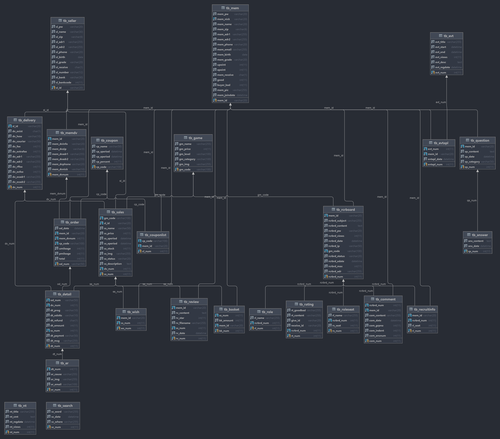

# Continue?

  

---

:loudspeaker: **한 줄 소개** : 콘솔 게임 오픈 마켓 및 모집 게시판

:speech_balloon: **제작 기간** : 2022.11.16 ~ 2022.12.26

:running: **팀 구성** : 4명

:bulb: **사용 Skill**

Frontend : HTML, CSS, Javascript, jQuery, JSTL, Bootstrap

Backend : Java, JSP, SpringBoot

Database : MyBatis, MariaDB

Server : Apache Tomcat

---

 **Github**

: [https://github.com/daaaaaeun/ProjectContinue](https://github.com/daaaaaeun/ProjectContinue)

 **PPT**

: [https://www.miricanvas.com/v/11nv5pm](https://www.miricanvas.com/v/11nv5pm)

 

 **ERD**
    

    
---

:page_with_curl: **담당 업무**
1. 로그인, 회원가입
2. 공지사항, 이벤트 게시판
3. 관리자, 판매자 index 페이지
4. 프로젝트 시연 및 발표
5. 일지 기록

